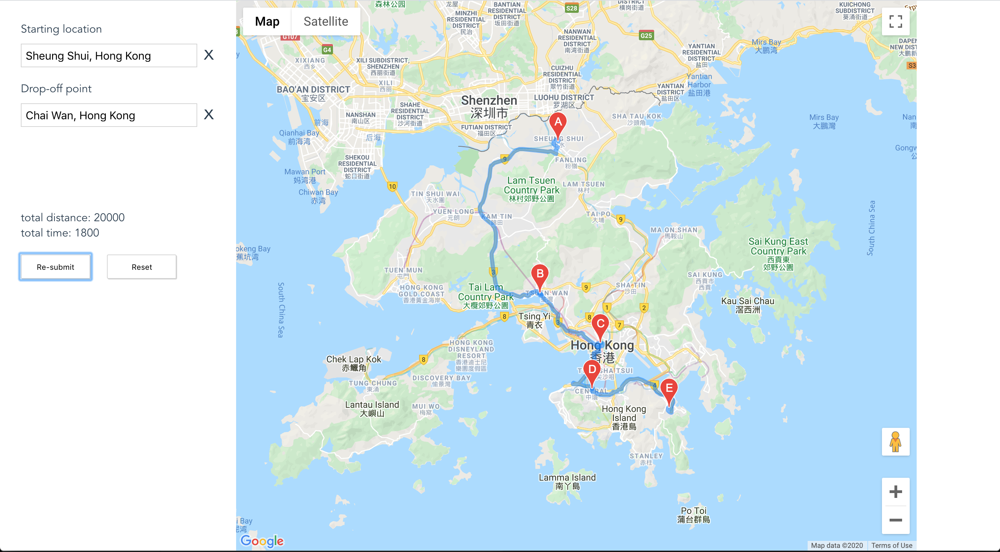

# Introduction

This Vue.js web application allows user to submit one pickup and drop-off point. It display the waypoints returned from the backend(API call).​

The App is live [here](https://haha-shop.netlify.com)



## App progress
1.  User submit one pickup and drop-off point. Address fields are come with autocomplete options.
2. `POST` method with address content to the Mock API by `axios`. It purposed to collect `token`.
3. Make API call by`GET` method with `token` from last step. Various status response as below:
  - `in progress`: It represent server side still in progress. Then it process retry instantly max to 5 times. Variable `retryCounter` are editable in `MyMap.vue`. `Collecting route in progress...` message will inform user by green text.
  - `failure`: Print `Location not accessible by car` message to user by red text.
  - `success`: Print `total distance` and `total distance` to screen. Also render marker and route in map.

## Prequisite
- Install [nodeJS]([https://nodejs.org/en/download/](https://nodejs.org/en/download/))
## Installation
``` bash
# install dependencies
npm install
```
## App configuration
### Get Google Maps API KEY
1. [Generating an Google Maps API key](https://developers.google.com/maps/documentation/javascript/get-api-key)
2. Enable `Maps JavaScript API`
3. Enable `Places API` (for autocomplete feature)

### Update `config/{dev/prod/test}.env.js`
Replace `YOUR-GOOGLE-API-KEY` and `YOUR-MOCK-API-DOMAIN` ㊙️ with your own key

㊙️ Hints: `https://mock-api.dev.XXX.com`
## App in development mode
``` bash
# serve with hot reload at localhost:8080 with ESLint errors and warnings
npm run dev
```
## Run Tests
Unit test files [path](test/unit/specs/)
``` bash
# run unit tests
npm run unit

# run e2e tests
npm run e2e

# run all tests
npm test
```
## Create production build
``` bash
# Build for production with minification to
# Out put dir: dist/
npm run build
```
See Vue.js official deployment [guidelines](https://cli.vuejs.org/guide/deployment.html) for more information.


## TODO
### Validator for empty address
For now it conflits with autocomplete feature. For example when the value is out of autocomplete options list(e.g. `abc888`). Then input value keep as empty(not `abc888`). Which do not consistant with front-end value(`abc888`).
